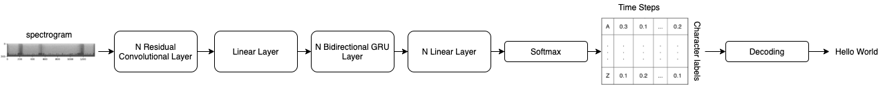

# DeepSpeech-pytorch

End-to-end speech recognition model in PyTorch


### Data pipeline

For testing the model we used the Librispeech dataset and performed a MelSpectogram followed by FrequencyMasking to mask out the frequency dimension, and TimeMasking for the time dimension.

```py
train_audio_transforms = nn.Sequential(
    torchaudio.transforms.MelSpectrogram(sample_rate=16000, n_mels=128),
    torchaudio.transforms.FrequencyMasking(freq_mask_param=15),
    torchaudio.transforms.TimeMasking(time_mask_param=35)
)
```


### The model
The model is a variation of DeepSpeech 2 from the guys at [assemblyai](https://www.assemblyai.com/)

With the following architecture:


### Training

We trained in the full librispeech dataset with a [CTC loss function](https://pytorch.org/docs/stable/generated/torch.nn.CTCLoss.html) that is very well explained at https://distill.pub/2017/ctc/

### Results

Still training

#### Reproduce the results

Just install al requirements and run

```bash
python train.py --config_path config/libri.yaml --experiment_name test
```

Tensorboard logs will be saved under the `runs/` folder
